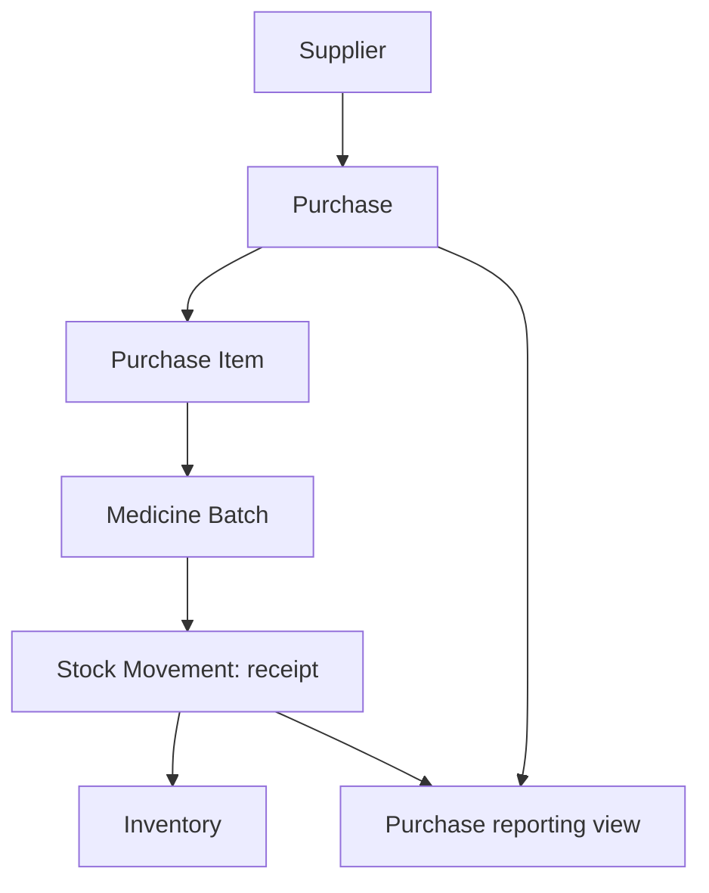
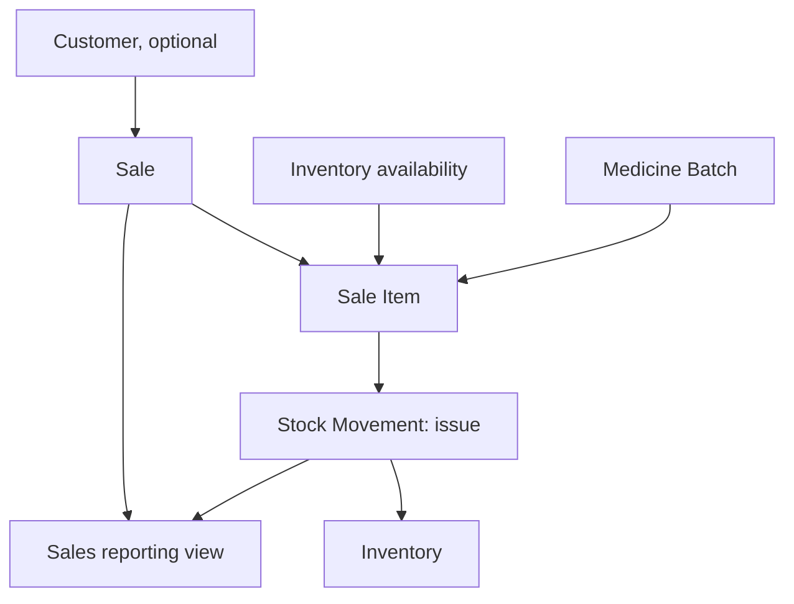
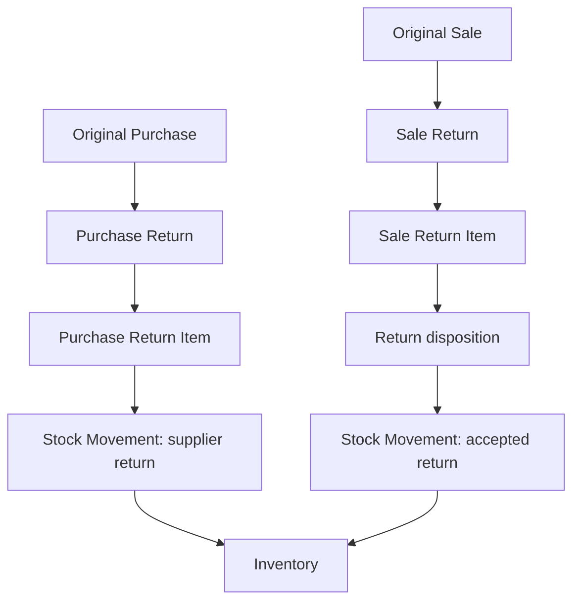
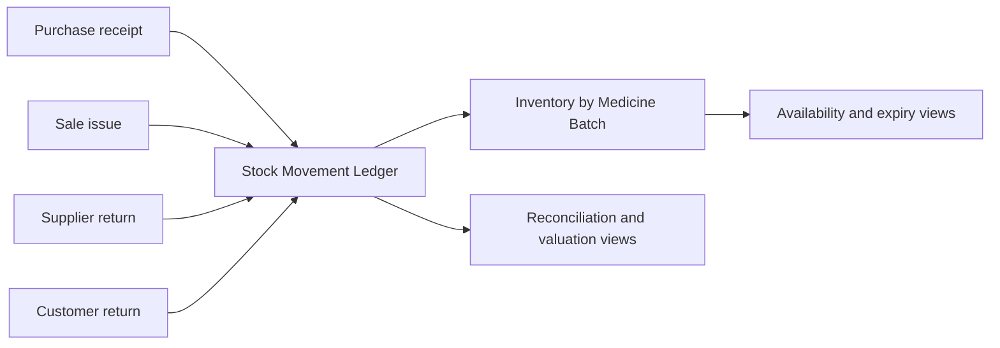
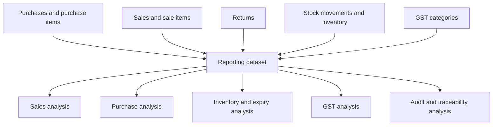

# EvoPharm Retail ERP — Data Flow

## Flow design principles

Commercial documents capture a point-in-time record. Their finalized line items identify a medicine batch. Inventory-impacting events create stock-movement ledger entries, which update the current inventory projection. Reporting consumes retained document, ledger, and projection data without becoming a source of operational data.

## Purchase flow

The purchase captures supplier and financial details. Each item establishes or references a batch. A receipt movement provides the traceable stock effect, and inventory becomes the current-stock projection.

## Sales flow

The sale retains a customer only when applicable. Each sale item identifies the batch issued. The issue movement reduces the inventory projection and preserves the source invoice reference for analysis and traceability.

## Return flow

Both return types retain an explicit link to their original commercial document and item. A supplier return removes batch stock. A customer return records a restock disposition before its inventory effect is represented in the ledger.

## Inventory flow

Inventory is not the source of the stock history. The stock-movement ledger is the traceable event record; inventory is the current per-batch state derived from it.

## Reporting flow

Reports are read-oriented outputs. They consume authoritative persisted records and do not create or modify commercial, inventory, or master data.
