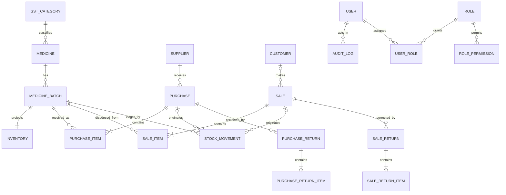

# EvoPharm Retail ERP — Domain Model

## Scope and modelling principles

This model describes the future business vocabulary for a single retail-pharmacy operation. It separates master data, commercial documents, inventory traceability, access control, configuration, and auditability. Quantities that can affect stock are traceable to a medicine batch and an immutable stock movement. Monetary amounts are retained on transaction lines so that historical documents remain understandable if master data later changes.

## Major entities

| Entity | Responsibility |
| --- | --- |
| Medicine | Defines a saleable medicine product independent of a particular delivery or expiry date. It owns product identity, regulatory/classification references, pack and unit descriptions, and default commercial attributes. |
| Medicine Batch | Represents a supplier-provided, traceable lot of one medicine. It carries batch number, manufacture/expiry dates, purchase cost, and batch-specific availability context. |
| Purchase | Is the supplier-facing commercial document that records a stock acquisition, its supplier, dates, document references, and financial totals. |
| Purchase Item | Is one medicine-batch line on a purchase. It records the purchased quantity, price, discount, tax snapshot, and line totals. |
| Sale | Is the customer-facing commercial document for a retail sale. It records the customer when applicable, dates, invoice references, payment summary, tax summary, and totals. |
| Sale Item | Is one batch-specific medicine line on a sale. It records dispensed quantity, price, discount, tax snapshot, and line totals. |
| Supplier | Is the master record for an organization supplying medicine or related retail stock. It owns business identity, contacts, tax registration, and address data. |
| Customer | Is the master record for a retail customer or patient-linked buyer where the business elects to retain it. It owns identity, contacts, tax registration where relevant, and address data. |
| Stock Movement | Is the immutable inventory ledger event. It records the stock effect, source document reference, medicine batch, quantity direction, and occurred-at timestamp. |
| Inventory | Is the current-stock projection for a medicine batch at the pharmacy. It holds on-hand, reserved, and available quantity values derived from the stock ledger. |
| GST Category | Defines a reusable Indian GST classification and its applicable tax rates. It is referenced by medicines and copied to transaction lines as a historical snapshot. |
| User | Identifies a human operator permitted to use the ERP. It owns profile, account state, and security credential references. |
| Role | Groups permissions into a named access-control responsibility. |
| Settings | Holds application-wide, non-transactional configuration such as organization details, invoice preferences, locale, and operational defaults. |
| Audit Log | Is an append-only record of security-relevant and business-relevant state changes, including actor, target, time, source, and before/after context. |
| Purchase Return | Records stock and financial value returned to a supplier against an original purchase when applicable. |
| Purchase Return Item | Records each batch-specific quantity and value returned within a purchase return. |
| Sale Return | Records stock and financial value accepted back from a customer against an original sale when applicable. |
| Sale Return Item | Records each batch-specific quantity and value returned within a sale return. |
| User Role | Associates users with one or more roles without duplicating role data in the user record. |
| Role Permission | Associates roles with named permissions so permissions can evolve independently of roles. |

## Relationships

## Relationship rules

- A medicine can have many batches; a batch belongs to exactly one medicine.
- Each purchase item and sale item references one medicine batch, preserving batch and expiry traceability.
- Inventory is maintained per medicine batch. The ledger remains the source of traceability; inventory is the current-state projection.
- A purchase belongs to one supplier. A sale may belong to one customer, allowing anonymous retail sales.
- Purchase and sale documents contain one or more items in their finalized form.
- Every inventory-affecting commercial event is represented by one or more stock movements. The source document is retained as a typed reference rather than duplicated business data.
- Returns reference their originating purchase or sale and use batch-specific return items; their stock effects are independently recorded in stock movement.
- GST category is a master reference for medicine defaults. Purchase, sale, and return items retain their own tax-rate and tax-amount snapshots.
- Users can hold many roles, and roles can be granted to many users through User Role. Role Permission uses the same many-to-many pattern.
- Settings are application-wide configuration records, not operational transaction records. Audit Log can reference any governed entity through a typed target reference.

## Lifecycle and historical integrity

- Commercial documents, stock movements, and audit entries are historical records; changing a master record must not rewrite their captured line-level values.
- Batch identity, expiry information, and document references are retained for recall, valuation, and regulatory traceability.
- Inactive master records remain referencable by historical documents.
- Inventory quantities are not a substitute for the stock ledger; reconciliations compare the projection with the movement history.
