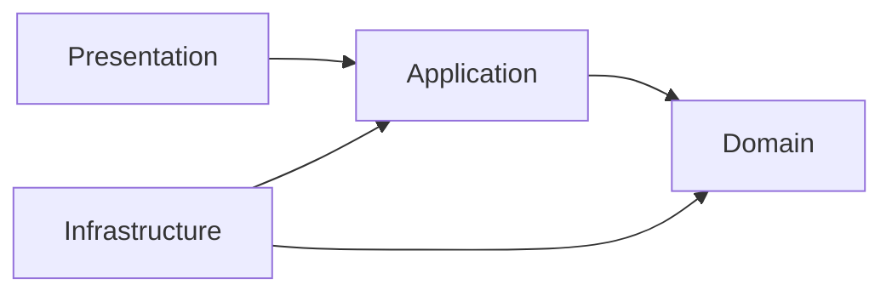
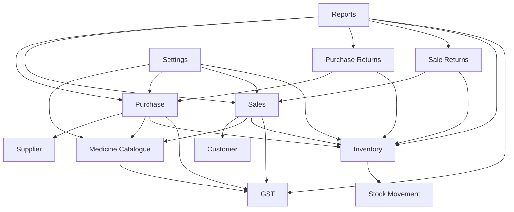

# EvoPharm Retail ERP — Module Dependencies

## Dependency rule

Dependencies point inward to stable domain contracts. Presentation coordinates application use cases; application depends on domain abstractions; infrastructure implements external concerns. No domain module depends on UI, database technology, reporting, or framework details.

## Allowed business-module communication

| Source module | May depend on | Reason |
| --- | --- | --- |
| Medicine Catalogue | GST Category, Inventory | Provides product classification and product-level stock visibility. |
| Purchase | Supplier, Medicine Catalogue, Inventory, GST, Audit | Acquires batch stock and captures purchase tax data. |
| Sales | Customer, Medicine Catalogue, Inventory, GST, Audit | Issues batch stock and captures sale tax data. |
| Purchase Returns | Purchase, Supplier, Inventory, Audit | Reverses or corrects supplier acquisition records. |
| Sale Returns | Sales, Customer, Inventory, Audit | Records customer returns against sales history. |
| Inventory | Medicine Catalogue, Stock Movement | Projects current stock from batch-level events. |
| Reports | Purchase, Sales, Returns, Inventory, GST, Audit | Reads consolidated data for analysis; it does not write back. |
| Access Control | User, Role, Audit | Governs actor identity and permission assignments. |
| Settings | All modules | Supplies read-only configuration values to each module. |
| Audit | All modules | Receives event records; it does not invoke operational modules. |

## Explicit dependency directions

## Circular-dependency prevention

- **Inventory never depends on Purchase, Sales, or Returns.** Those modules emit inventory-affecting events through a stock-movement contract; Inventory consumes the event record.
- **Reports never drive operational modules.** Reports read their documented data sources and cannot call Purchase, Sales, or Inventory to mutate data.
- **GST is a shared reference module.** Purchase and Sales consume GST classification and retain tax snapshots; GST does not depend on them.
- **Medicine Catalogue owns product and batch identity.** Purchase and Sales reference it but do not own or mutate product definitions as a side effect of their workflows.
- **Audit is a sink.** Modules may publish audit information to it; Audit never calls the originating module.
- **Settings is a provider.** Modules may read settings through a configuration contract; Settings does not reference operational modules.
- **Cross-module links use contracts, document identifiers, and typed events.** A module must not reach into another module's persistence implementation.

## Layer-level communication constraints

| Layer | Allowed dependencies | Prohibited dependencies |
| --- | --- | --- |
| Domain | Standard language constructs and domain contracts | UI, ORM, SQLite, FastAPI, filesystem, reports, and infrastructure implementations |
| Application | Domain contracts and application contracts | PySide6 widgets and concrete database implementations |
| Presentation | Application contracts and presentation concerns | Direct database access and domain persistence details |
| Infrastructure | Application and domain contracts; external libraries | Presentation components |

These constraints maintain independent business modules and allow each module to be changed or tested without circular imports or technology coupling.
